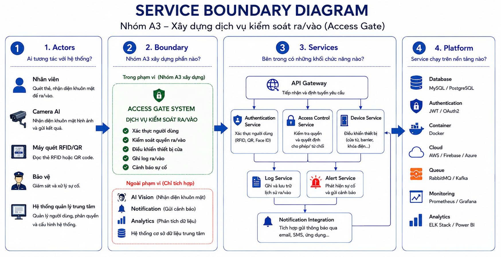

# Service Boundary của nhóm

## 1. Thông tin nhóm

- Tên nhóm: Nhóm 3
- Lớp: CNTT 17-08
- Thành viên:
  - Nguyễn Mạnh Tuân
  - Kiều Duy Vinh
  - Bùi Trung Quân
  - Lỗ Văn Tuấn
- Service nhóm phụ trách: Access Gate
- Sản phẩm tổng thể của lớp: Product A
- Tên đề tài: Xây dựng dịch vụ kiểm soát ra/vào

---

## 2. Actor

Các actor tương tác với hệ thống:

- Người dùng
- Nhân viên bảo vệ
- Quản trị viên
- Camera AI
- Hệ thống IoT

---

## 3. System Boundary

Nhóm em xây phần:

- Kiểm soát ra/vào
- Xác thực người dùng
- Ghi log ra/vào
- Kiểm tra quyền truy cập
- Điều khiển mở/đóng cổng

Phần nhóm chỉ tích hợp:

- Camera Stream Service
- AI Vision Service
- Notification Service
- Database chung của hệ thống

---

## 4. Service Boundary

Service của nhóm có trách nhiệm:

- Kiểm tra quyền truy cập
- Nhận dữ liệu từ camera hoặc cảm biến
- Xử lý yêu cầu mở cổng
- Ghi nhận lịch sử ra/vào
- Gửi trạng thái đến service khác

Service KHÔNG làm:

- Phân tích AI hình ảnh
- Gửi thông báo
- Xử lý dữ liệu phân tích tổng hợp

---

## 5. Input / Output

### Input

- ID người dùng
- Dữ liệu camera
- Dữ liệu cảm biến
- Yêu cầu mở cổng

### Output

- Trạng thái cho phép/từ chối
- Lịch sử ra/vào
- Trạng thái cổng
- Log hệ thống

---

## 6. API dự kiến

| Method | Endpoint | Mục đích |
|---|---|---|
| GET | /health | Kiểm tra service |
| POST | /access/check | Kiểm tra quyền truy cập |
| POST | /gate/open | Mở cổng |
| POST | /gate/close | Đóng cổng |
| GET | /logs | Lấy lịch sử ra/vào |

---

## 7. Phụ thuộc service khác

Service này gọi đến:

- AI Vision Service
- IoT Ingestion Service
- Notification Service

Service khác gọi đến service này:

- Frontend Dashboard
- Core Business Service

---

## 8. Sơ đồ minh họa

